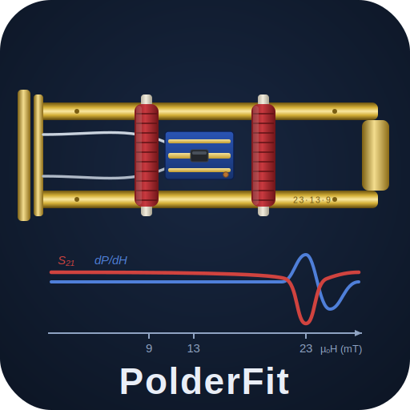

# PolderFit – Auswertung breitbandiger FMR-Messungen



PolderFit ist eine grafische Anwendung zur Auswertung breitbandiger ferromagnetischer
Resonanzmessungen (bbFMR). Sie liest die Messdaten im TDMS-Format ein, bestimmt je Frequenz
automatisch das Resonanzsignal, fittet es und stellt die gewonnenen Materialparameter zur
Auswertung und zum Export bereit. Die physikalischen Grundlagen sind in der Dokumentation
beschrieben.

**Dokumentation im Browser:** <https://ibrahimyalcinsoy.github.io/PolderFit/>

## Schnellstart

Voraussetzung: Git und Python ≥ 3.11 sind installiert. Block kopieren, ins Terminal
einfügen, Enter — die virtuelle Umgebung (`.venv`) kapselt alles ab.

**Windows** (Eingabeaufforderung `cmd`):

```bat
git clone https://github.com/ibrahimyalcinsoy/PolderFit.git && cd PolderFit
python -m venv .venv && call .venv\Scripts\activate
pip install -e ".[gui]"
polderfit
```

**Fedora / Debian** (bash):

```bash
git clone https://github.com/ibrahimyalcinsoy/PolderFit.git && cd PolderFit
python3 -m venv .venv && source .venv/bin/activate
pip install -e ".[gui]"
polderfit
```

Schritt-für-Schritt-Anleitung inkl. Git-/Python-Einrichtung:
[INSTALLATION_WINDOWS.md](INSTALLATION_WINDOWS.md).

## Start und Aktualisierung

```bash
polderfit                 # grafische Oberfläche (in aktivierter .venv)
python -m polderfit.app   # gleichbedeutend, zur Fehlersuche

git pull                              # auf neueste Version bringen
pip install -e ".[gui]"               # Abhängigkeiten auffrischen
```

Programmatische Nutzung:

```python
from polderfit.io.tdms_laden import lade_tdms
from polderfit.fit.batch import fitte_alle

datensatz = lade_tdms("Messung.tdms")   # Format wird automatisch erkannt
stapel = fitte_alle(datensatz)          # AutoWindow + Fit über alle Frequenzen
```

## Bekannte Stolperstellen

- **PowerShell** lehnt die Aktivierung ab (*„running scripts is disabled"*):
  einmalig `Set-ExecutionPolicy -Scope CurrentUser RemoteSigned`, oder `cmd` nutzen.
- **Debian 12**, Fenster öffnet nicht (*„Qt platform plugin xcb"*):
  `sudo apt install -y libxcb-cursor0`.

## Dokumentation

Im Browser unter <https://ibrahimyalcinsoy.github.io/PolderFit/> (automatisch aus dem
Repository veröffentlicht). Quellen im Verzeichnis `docs/`; lokale HTML-Vorschau mit
`mkdocs serve`.

| Kapitel | Inhalt |
|---|---|
| `docs/index.md` | Überblick und Auswertekette |
| `docs/installation.md` | Installation, Start, Tests |
| `docs/datenformate.md` | TDMS-Formate, Datenmodell |
| `docs/kanal-mapping.md` | Kanal-Zuordnung und Profile |
| `docs/verarbeitung.md` | Verarbeitungskette (divide slice, derivative divide) |
| `docs/auswertungsauswahl.md` | Frequenz-/Feld-Jumper, Bereichseinschränkung |
| `docs/interaktives-fitten.md` | In-Plot-Fitting, Rechteck-Nachfit, Zonen |
| `docs/ausreisser.md` | Ausreißer-Management, Projekt speichern/laden |
| `docs/pipeline.md` | Laden → AutoWindow → Fit → Bewertung |
| `docs/autowindow.md` | automatische Resonanzbestimmung |
| `docs/physik-und-fit.md` | Physikalisches Modell, S21-Fit, Kittel/LLG, Quellen |
| `docs/bewertung.md` | Gütemaße und Problem-Einstufung |
| `docs/tuning.md` | einstellbare Parameter |
| `docs/troubleshooting.md` | typische Fehlerbilder |
| `docs/test-harness.md` | Robustheitsprüfung über reale Messdaten |

## Architektur

```
polderfit/
  io/          Einlesen/Schreiben TDMS, Datenstruktur (Linescan, Messdatensatz)
  physik/      Physikalische Modelle und Konstanten (Fitmodell, Kittel/LLG)
  fit/         AutoWindow, Einzelfit (lmfit), Stapelverarbeitung, Bewertung
  auswertung/  Resonanz vs. f/T, Kittel-/LLG-Fit, Publikationsplots
  persistenz/  Excel/CSV-Export, Sitzungszustand
  gui/         PySide6-Oberfläche mit eingebettetem Matplotlib
  app.py       Einstiegspunkt
```

Die physikalischen Modelle und ihre Quellen sind im Kapitel „Physikalisches Modell und Fit"
der Dokumentation beschrieben.

## Copyright

© 2026 Ibrahim Yalcinsoy – alle Rechte vorbehalten. Einzelheiten siehe
[LICENSE](LICENSE).
