# Einfacher Vergleich PolderFit V0.1.0 – LabVIEW-FTF (Stand 2026-08-25)

Je Frequenz werden die Einzelfit-Werte beider Programme direkt verglichen: **PolderFit minus FTF** für Resonanzfeld und Linienbreite, dazu die globalen Kittel/LLG-Parameter. Keine Fehlerbalken, keine Verteilungen – nur Werte und Differenzen; die einzige Kennzahl ist der Median der Differenz („typische Abweichung“) und der Anteil der Frequenzen innerhalb ±1 mT (Feld) bzw. ±5 % (Linienbreite). Verglichen werden Frequenzen, an denen beide Programme ein Ergebnis liefern.

PolderFit lief mit den GUI-Standardwerten (Auto-Fit, Nachfenster ±2,5·ΔH, α-Obergrenze 0,1; FeCr₂S₄ mit α-Obergrenze 1,0). Hinweis: Alle FTF-Referenzen sind umsortierte Colormaps (siehe `BERICHT.md`, Abschnitt 1).

Abbildungen: `ergebnisse/einfach/<name>.png` (je Datensatz), `uebersicht.png`, `kittel_llg.png`; alles zusammen in `ergebnisse/einfach/Vergleich_PolderFit_FTF.pdf`; Werte je Frequenz in `ergebnisse/einfach/<name>.csv`.

## Einzelfits je Frequenz

| Datensatz | Frequenzen verglichen | B_res: typische Differenz | B_res innerhalb ±1 mT | ΔH: typische Differenz | ΔH innerhalb ±5 % | ΔH innerhalb ±10 % |
|---|---|---|---|---|---|---|
| cofe_gratings_ip_5K | 1061 von 1061 (PF problematisch 0, FTF ohne Ergebnis 0) | +0.753 mT | 26 % | -5.227 mT (-10.6 %) | 24 % | 49 % |
| cofe_wm_ip_290K_1 | 70 von 70 (PF problematisch 0, FTF ohne Ergebnis 0) | -0.036 mT | 100 % | +0.009 mT (+0.1 %) | 100 % | 100 % |
| cofe_wm_ip_290K_2 | 21 von 21 (PF problematisch 0, FTF ohne Ergebnis 0) | -0.025 mT | 100 % | +0.007 mT (+0.1 %) | 95 % | 100 % |
| cofe_wm_ip_5K_1 | 71 von 71 (PF problematisch 0, FTF ohne Ergebnis 0) | -0.031 mT | 100 % | -0.039 mT (-0.2 %) | 100 % | 100 % |
| cofe_wm_ip_5K_2 | 13 von 13 (PF problematisch 0, FTF ohne Ergebnis 0) | +0.250 mT | 92 % | -0.081 mT (-0.7 %) | 92 % | 92 % |
| fecr2s4_100K | 44 von 90 (PF problematisch 46, FTF ohne Ergebnis 0) | -15.601 mT | 0 % | +32.617 mT (+5.1 %) | 41 % | 66 % |
| fecr2s4_2K | 194 von 245 (PF problematisch 42, FTF ohne Ergebnis 10) | +37.239 mT | 1 % | -3.023 mT (-1.0 %) | 15 % | 26 % |
| fecr2s4_50K | 11 von 85 (PF problematisch 74, FTF ohne Ergebnis 0) | -36.882 mT | 0 % | -106.719 mT (-7.3 %) | 9 % | 27 % |
| yig_konstanz_ip_50K | 367 von 367 (PF problematisch 0, FTF ohne Ergebnis 0) | -0.175 mT | 99 % | +0.190 mT (+1.0 %) | 91 % | 100 % |

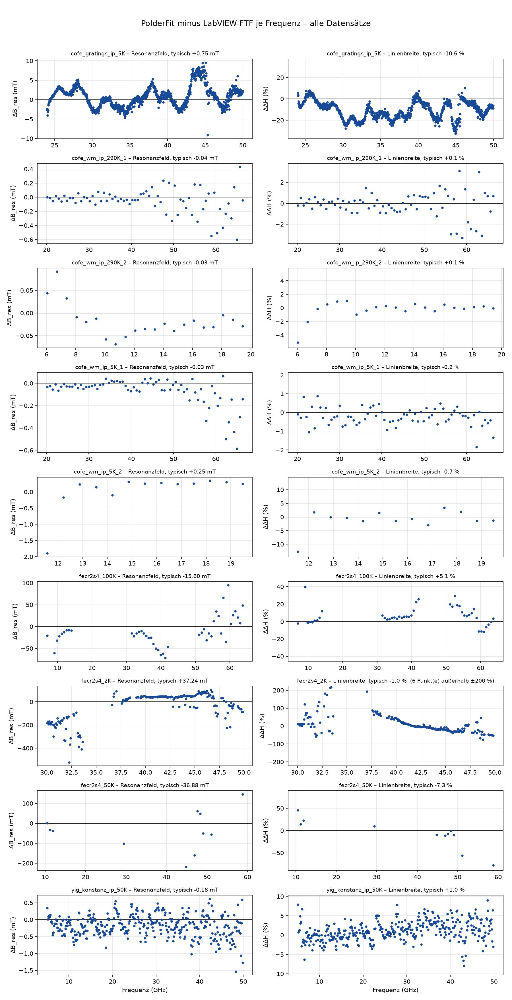

## Kittel/LLG-Parameter

PolderFit ungewichtet (Standard). FTF-„M eff“ (oop) ist in PolderFit-Konvention umgerechnet (Vorzeichen; FTF: B_res = ω/γ − M). FeCr₂S₄: die Fenster-Automatik ist für Linienbreiten ≳ 0,3 T nicht ausgelegt, viele PolderFit-Einzelfits sind dort problematisch (siehe `BERICHT.md`); die Werte sind entsprechend zu lesen.

| Datensatz | Geometrie | g PF / FTF (Diff.) | µ₀M_eff PF / FTF (T) | µ₀H_u PF / FTF (mT) | α PF / FTF (Diff.) | µ₀ΔH₀ PF / FTF (mT) |
|---|---|---|---|---|---|---|
| cofe_gratings_ip_5K | ip | 2.1111 / 2.1585 (-0.0474) | 1.8861 / 1.7422 (+0.1440) | 177.40 / 184.96 (-7.56) | 9.72e-03 / 1.15e-02 (-15.7 %) | 18.89 / 20.73 (-1.84) |
| cofe_wm_ip_290K_1 | ip | 2.1054 / 2.1053 (+0.0001) | 2.2496 / 2.2492 (+0.0004) | 3.05 / 3.14 (-0.09) | 7.34e-03 / 7.38e-03 (-0.6 %) | -0.92 / -1.01 (+0.08) |
| cofe_wm_ip_290K_2 ⚠ FTF-Kittel an der Fitgrenze (g = 4,000) – FTF-Wert unbrauchbar | ip | 1.9381 / 4.0000 (-2.0619) | 2.7486 / 0.5081 (+2.2404) | -0.94 / 5.45 (-6.39) | 5.21e-03 / 1.06e-02 (-50.8 %) | 3.25 / 3.34 (-0.09) |
| cofe_wm_ip_5K_1 | ip | 2.1065 / 2.1048 (+0.0017) | 2.3049 / 2.3104 (-0.0055) | 4.76 / 4.62 (+0.13) | 7.82e-03 / 7.86e-03 (-0.5 %) | -0.06 / -0.13 (+0.07) |
| cofe_wm_ip_5K_2 ⚠ FTF-Kittel an der Fitgrenze (g = 4,000) – FTF-Wert unbrauchbar | ip | 2.2566 / 4.0000 (-1.7434) | 2.0080 / 0.4552 (+1.5528) | 2.44 / 18.71 (-16.28) | 5.50e-03 / 8.26e-03 (-33.4 %) | 5.46 / 6.39 (-0.93) |
| fecr2s4_100K | oop | 1.7400 / 1.7595 (-0.0195) | 0.1680 / 0.2040 (-0.0360) | – | 2.09e-01 / 2.18e-01 (-4.3 %) | 15.05 / -36.95 (+52.00) |
| fecr2s4_2K ⚠ FTF-Kittel an der Fitgrenze (g = 4,000) – FTF-Wert unbrauchbar | oop | 5.7597 / 4.0000 (+1.7597) | 5.2934 / 5.0568 (+0.2366) | – | 4.95e-01 / 7.87e-01 (-37.1 %) | -157.90 / -851.98 (+694.09) |
| fecr2s4_50K | oop | 1.7670 / 1.8016 (-0.0347) | 1.8408 / 1.9011 (-0.0603) | – | 2.00e-01 / 4.34e-01 (-53.9 %) | 308.67 / -156.36 (+465.03) |
| yig_konstanz_ip_50K | ip | 2.0010 / 2.0006 (+0.0004) | 0.1303 / 0.1319 (-0.0016) | -3.75 / -4.48 (+0.73) | 1.78e-03 / 1.58e-03 (+12.6 %) | 16.36 / 16.52 (-0.16) |

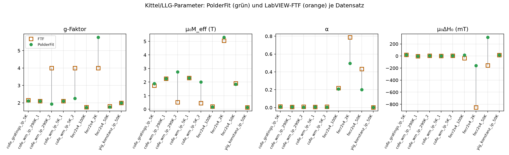

## Abbildungen je Datensatz

### cofe_gratings_ip_5K – CoFe-Gitter 138 nm, ip, 5 K

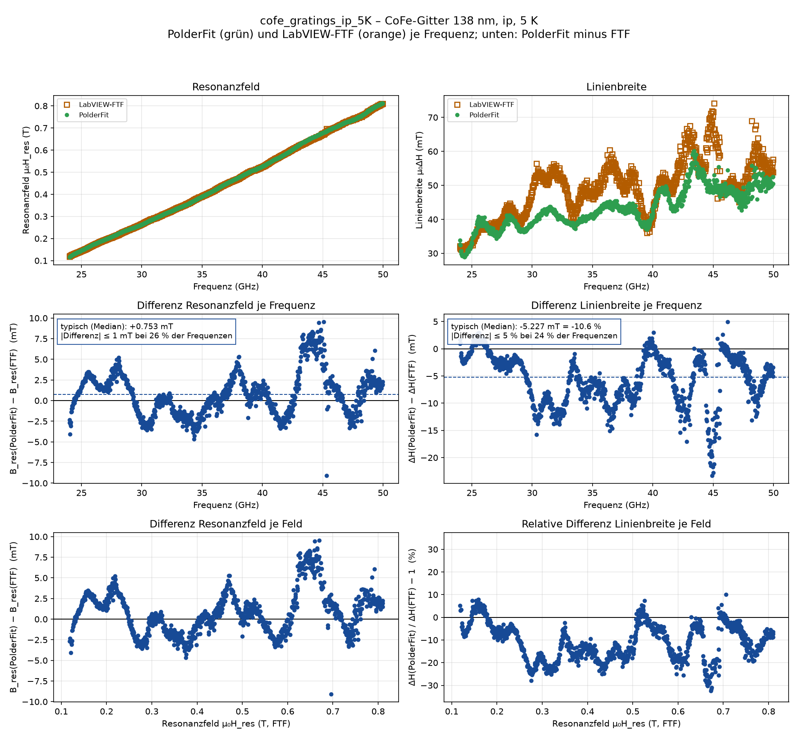

### cofe_wm_ip_290K_1 – CoFe, ip, 290 K, 20–66 GHz

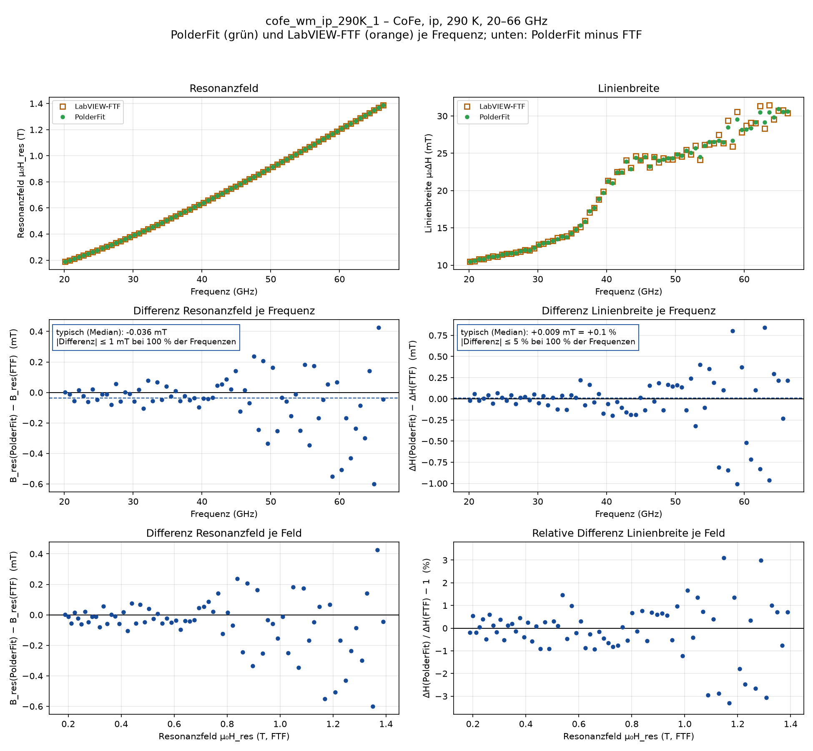

### cofe_wm_ip_290K_2 – CoFe, ip, 290 K, 6–19 GHz

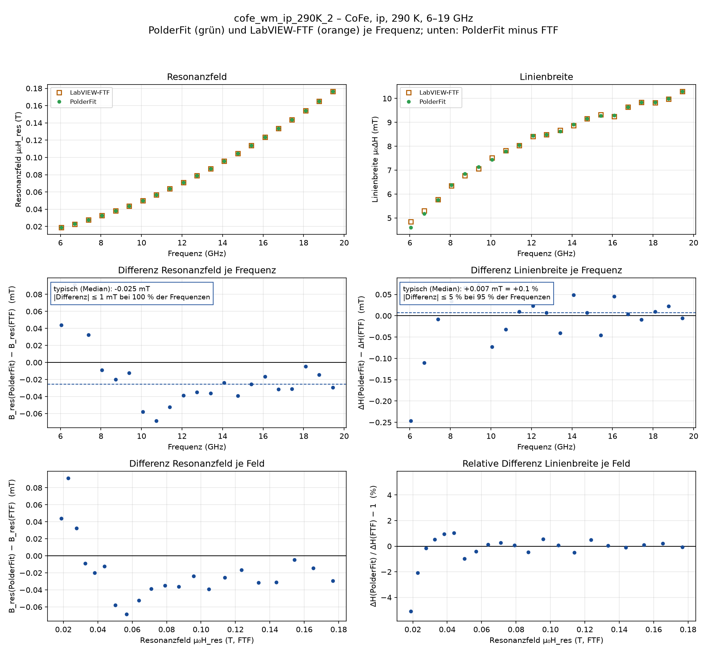

### cofe_wm_ip_5K_1 – CoFe, ip, 5 K, 20–66 GHz

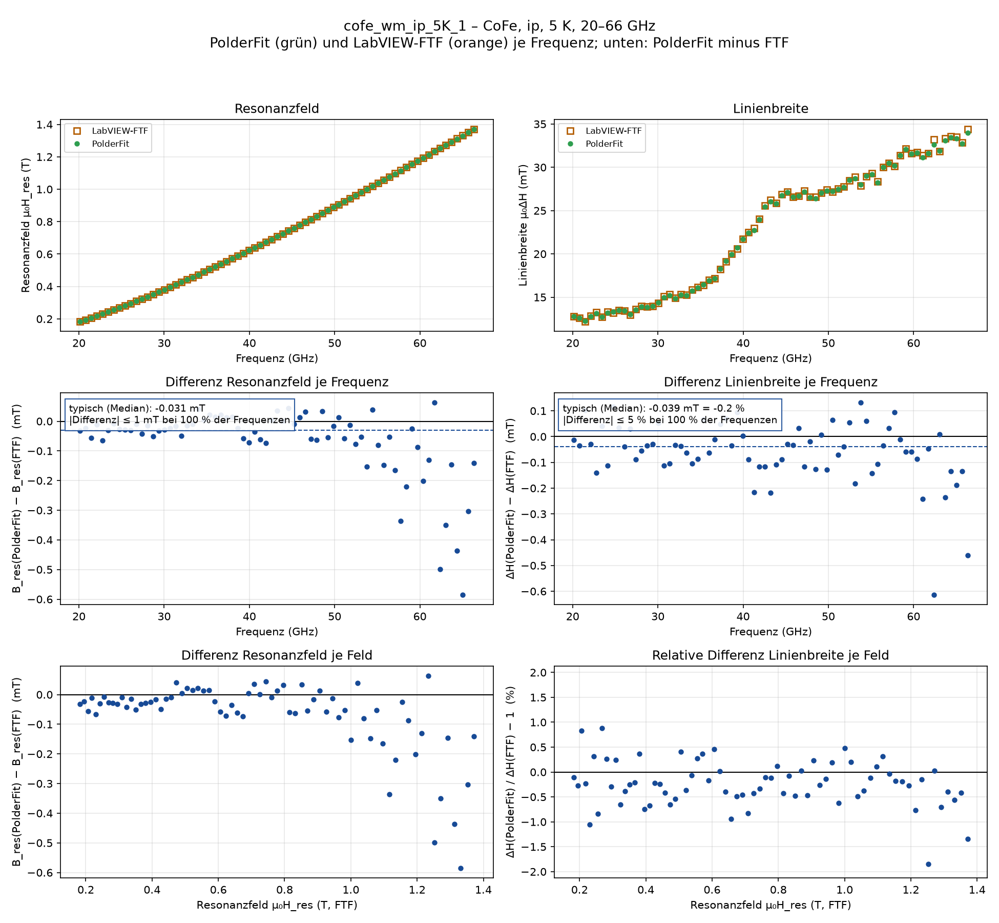

### cofe_wm_ip_5K_2 – CoFe, ip, 5 K, 6–19 GHz

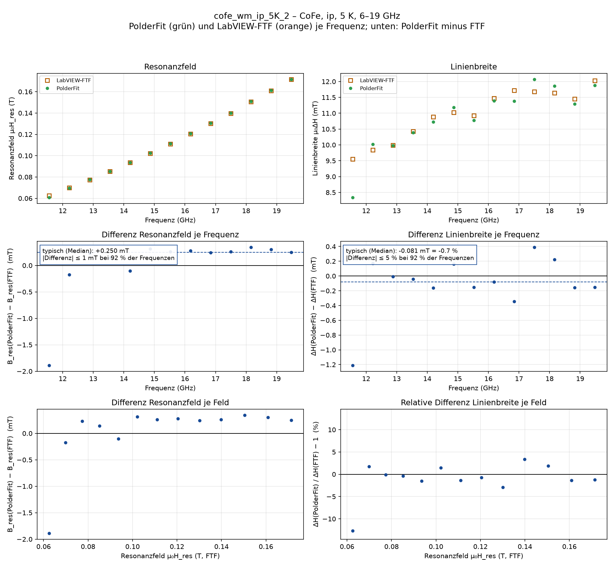

### fecr2s4_100K – FeCr₂S₄, oop, 100 K (α-Obergrenze 1,0)

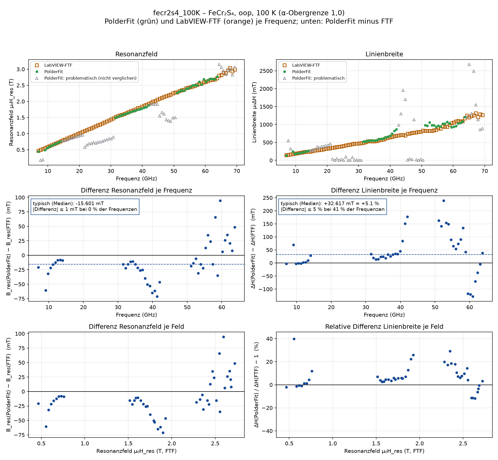

### fecr2s4_2K – FeCr₂S₄, oop, 2 K (α-Obergrenze 1,0)

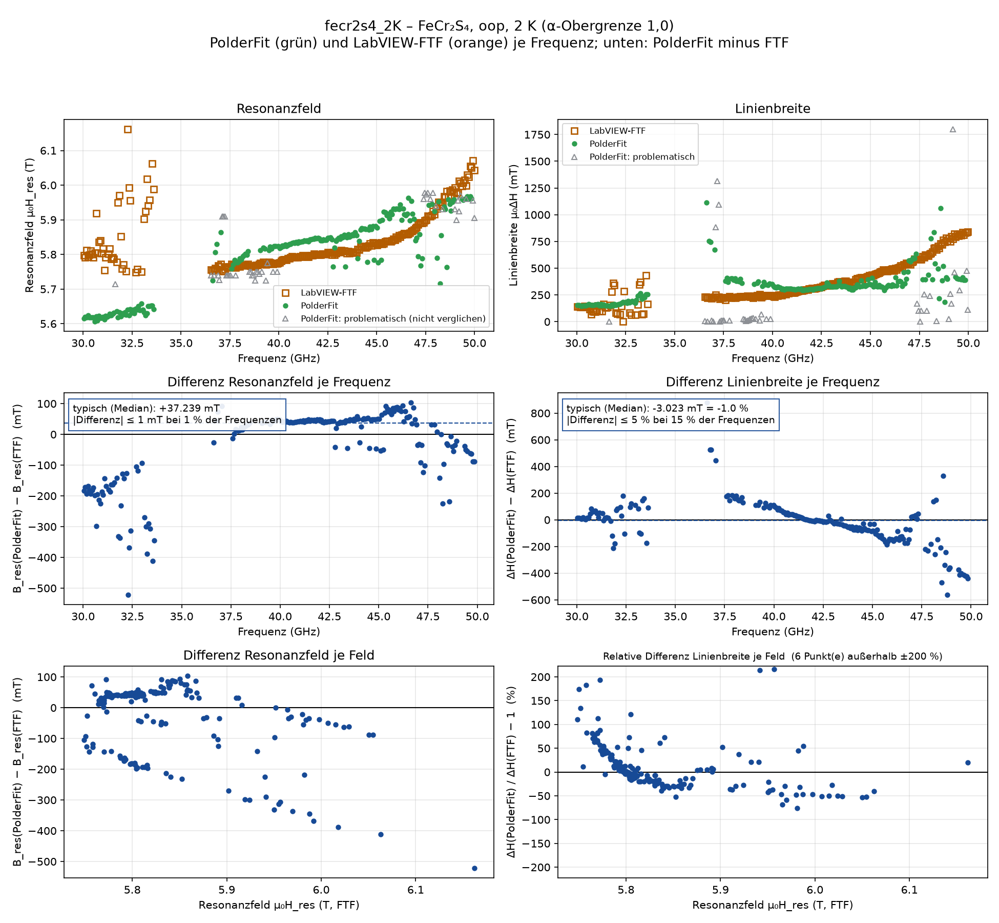

### fecr2s4_50K – FeCr₂S₄, oop, 50 K (α-Obergrenze 1,0)

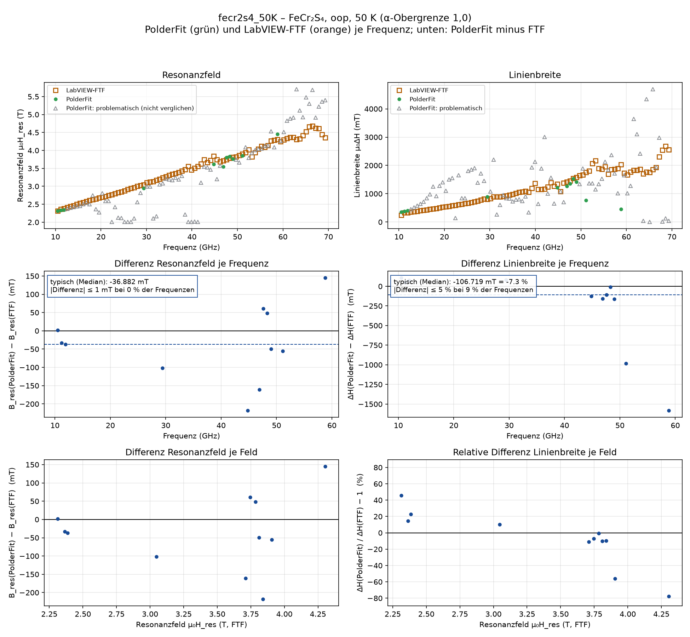

### yig_konstanz_ip_50K – YIG 180 nm, ip, 50 K

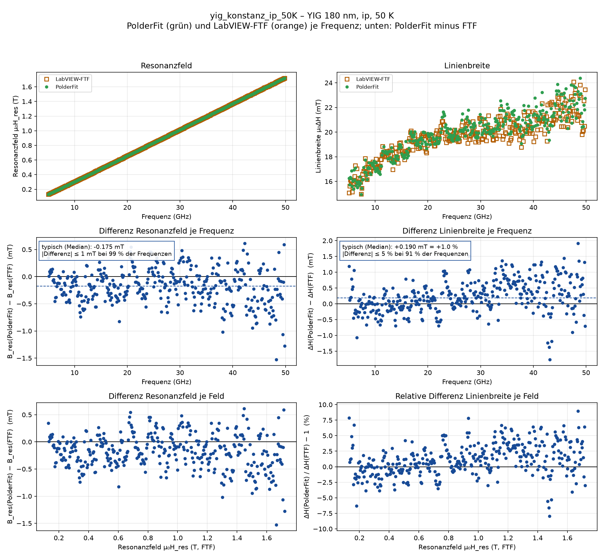

