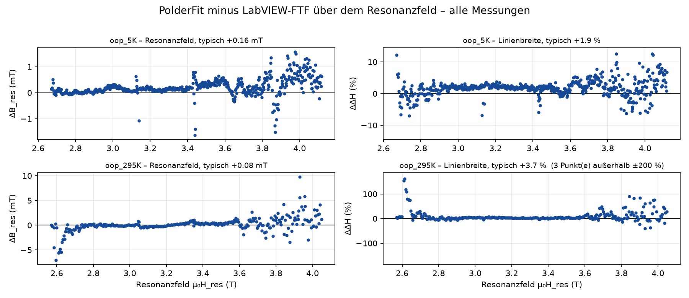
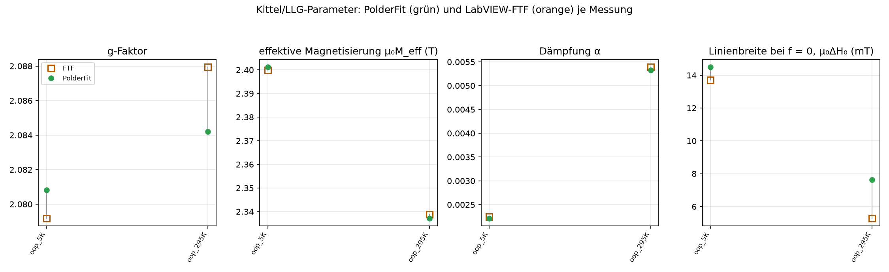
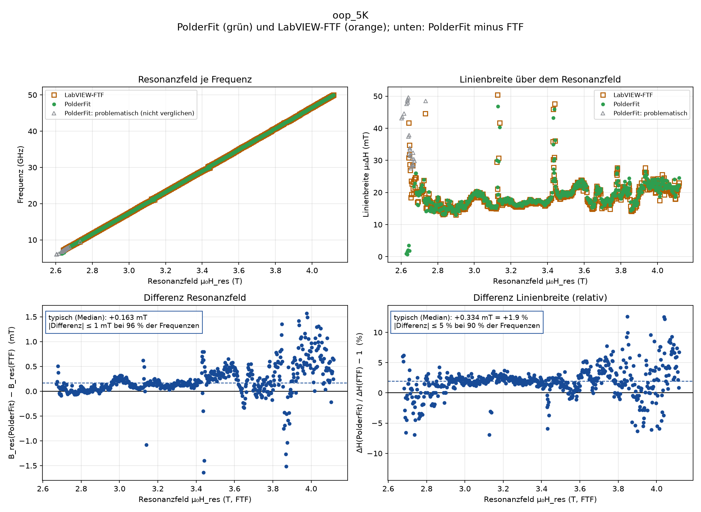
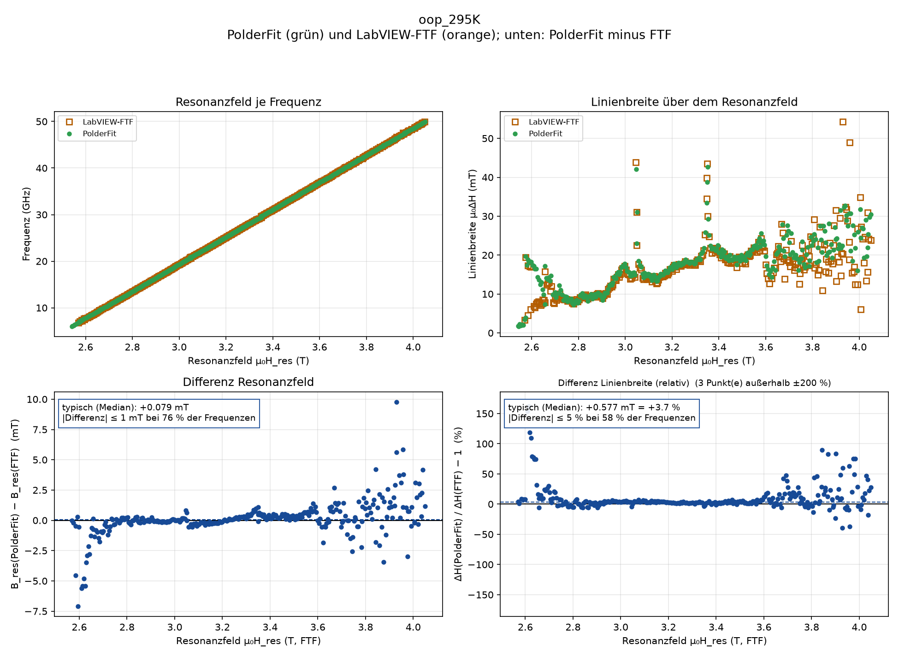

# Einfacher Vergleich PolderFit V0.1.57 – LabVIEW-FTF (Stand 2026-08-26)

Je Frequenz werden die Einzelfit-Werte beider Programme direkt verglichen: **PolderFit minus FTF** für Resonanzfeld und Linienbreite, dazu die globalen Kittel/LLG-Parameter. Keine Fehlerbalken, keine Verteilungen – nur Werte und Differenzen; die einzige Kennzahl ist der Median der Differenz („typische Abweichung“) und der Anteil der Frequenzen innerhalb ±1 mT (Feld) bzw. ±5 % (Linienbreite). Verglichen werden Frequenzen, an denen beide Programme ein Ergebnis liefern.

PolderFit lief mit den Standardwerten der Oberfläche (Auto-Fit; zweiter Fit-Durchgang auf ±2,5 Linienbreiten; Dämpfung α im Fit bis 0,1 erlaubt, bei FeCr₂S₄ bis 1,0). Alle Abbildungen wie in der Oberfläche: **Feld auf der x-Achse, Frequenz auf der y-Achse** bzw. als obere Zusatzachse. Hinweis: Die FTF-Referenzen stammen aus umsortierten Frequenz-Sweeps (siehe `BERICHT.md`, Abschnitt 1).

Dieser Ordner ist eigenständig (unabhängig von den älteren, ausführlichen Ergebnissen unter `../ergebnisse/`): `<Kürzel>.png` (je Messung), `uebersicht.png`, `kittel_llg.png`, alles zusammen in `Vergleich_PolderFit_FTF.pdf`; Werte je Frequenz in `<Kürzel>.csv`, Kennzahlen in `kennzahlen.json`. Erzeugt mit `python benchmark_ftf/einfacher_vergleich.py`. Kürzel ↔ Messung: Tabelle am Ende.

## Begriffe

| Begriff | Bedeutung |
|---|---|
| Resonanzfeld B_res | Feld µ₀H (Tesla), bei dem die Resonanz liegt – je Frequenz ein Wert |
| Linienbreite µ₀ΔH | volle Breite der Resonanz (mT) |
| Dämpfung α | Gilbert-Dämpfung (dimensionslos); Steigung der Linienbreite über der Frequenz |
| µ₀M_eff, µ₀H_u, µ₀ΔH₀ | effektive Magnetisierung, Anisotropiefeld, Linienbreite bei f = 0 (Kittel/LLG) |
| Feld in der Ebene / senkrecht | Messgeometrie: Magnetfeld parallel zur Schicht (ip) bzw. senkrecht dazu (oop) |
| typische Differenz | Median aller Differenzen PolderFit − FTF (Ausreißer verzerren ihn nicht) |
| FTF | LabVIEW-Auswerteprogramm „fiddling together FMR“ (Referenz) |

## Einzelfits je Frequenz

| Messung | Frequenzen verglichen | B_res: typische Differenz | B_res innerhalb ±1 mT | ΔH: typische Differenz | ΔH innerhalb ±5 % | ΔH innerhalb ±10 % |
|---|---|---|---|---|---|---|
| oop_5K | 599 von 629 (PF problematisch 24, FTF ohne Ergebnis 15) | +0.163 mT | 96 % | +0.334 mT (+1.9 %) | 90 % | 99 % |
| oop_295K | 308 von 315 (PF problematisch 0, FTF ohne Ergebnis 7) | +0.079 mT | 76 % | +0.577 mT (+3.7 %) | 58 % | 76 % |

## Kittel/LLG-Parameter

PolderFit ungewichtet (Standard). FTF-„M eff“ bei senkrechtem Feld ist in die PolderFit-Konvention umgerechnet (Vorzeichen; FTF: B_res = ω/γ − M). FeCr₂S₄: die automatische Fenstersuche ist für Linienbreiten ≳ 0,3 T nicht ausgelegt, viele PolderFit-Einzelfits sind dort problematisch (siehe `BERICHT.md`); die Werte sind entsprechend zu lesen.

| Messung | g PF / FTF (Diff.) | µ₀M_eff PF / FTF (T) | µ₀H_u PF / FTF (mT) | α PF / FTF (Diff.) | µ₀ΔH₀ PF / FTF (mT) |
|---|---|---|---|---|---|
| oop_5K | 2.0808 / 2.0792 (+0.0016) | 2.4012 / 2.3999 (+0.0013) | – | 2.21e-03 / 2.25e-03 (-1.4 %) | 14.50 / 13.71 (+0.79) |
| oop_295K | 2.0842 / 2.0879 (-0.0037) | 2.3372 / 2.3388 (-0.0016) | – | 5.32e-03 / 5.39e-03 (-1.2 %) | 7.64 / 5.28 (+2.36) |

## Abbildungen je Messung

### oop_5K

### oop_295K

## Kürzel der Ordner und Dateien

| Kürzel (Ordner/Datei) | Messung |
|---|---|
| `oop_5K` | `testdata-n-lorentz/2025-NOV-11-Linescan-2D-map-oop-5K_1.1deg-for-FTF.tdms` (oop, 5 K, 1,1°, 6–50 GHz, 629 Linescans, für FTF sortiert) + `…(FTF)/` |
| `oop_295K` | `testdata-n-lorentz/2025-NOV-12-Linescan-2D-map-oop-295K_1.1deg-test-for-FTF.tdms` (oop, 295 K, 1,1°, 6–50 GHz, 629 Linescans; FTF-Referenz enthält nur jede 2. Frequenz (0,14-GHz-Raster), jede Zeile doppelt → 315 vergleichbare Frequenzen) + `…(FTF)/` |

## Hinweis: Zwei-Moden-Daten

Beide Messungen zeigen zwei nahe Resonanzen (Nebenmode ≈ 18 mT oberhalb der Hauptmode, ΔH ≈ 5–6 mT). Die FTF-Referenz ist ein **Ein-Resonanz-Fit**, verglichen wurde deshalb der PolderFit-Ein-Moden-Fit (Tabelle oben). Zur Einordnung der Hauptmode aus dem zweistufigen Zwei-Moden-Fit (Auto-Fit-Dialog „2 Resonanzen“ + „erst klassisch, dann ergänzen“) gegen dieselbe FTF-Referenz: B_res typisch **+1,8 mT** (5 K) bzw. **+1,7 mT** (295 K) und ΔH **−4 %** (5 K) – der Ein-Lorentz-Fit (FTF wie PolderFit mit 1 Mode) absorbiert die Nebenmode in eine etwas breitere, verschobene Linie; das ist ein Modellunterschied, kein Fitfehler. Bei 295 K unterhalb ≈ 9 GHz (µ₀H_res 2,58–2,70 T) überlappen beide Moden vollständig; dort fittet PolderFit die Summenlinie (ΔH ≈ 15–20 mT), FTF die schmalere Komponente (ΔH ≈ 2–8 mT) – daher die Differenzen bis −7 mT / +100 % am linken Rand.
