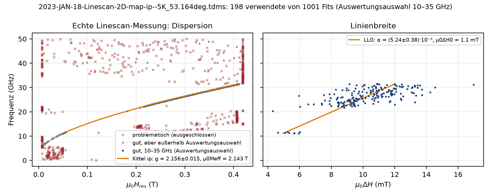

# Ausreißer, Projektdateien, Einstellungen, Speichern

**Ausreißer / ignorieren** (`Strg+M` im Farbplot, `Strg+I` für den aktuellen Fit oder Klick im Kittel-Fenster `Strg+K`): Punkt aus Kittel/LLG, Plots und Globalparametern entfernt (grau, Status `ignoriert`); Einzelfit bleibt; Spalte `ausreisser` im Export; Panel *Wieder aufnehmen*; rückgängig per `Strg+Z`.



**Projekt** (`Datei → Projekt speichern`, JSON Formatversion 3): Quelle, Kanal-Zuordnung, Auswertungsauswahl, γ, Fenster je Frequenz, Zonen, **Grenzgeraden**, Ausreißer, **Bewertung je Fit**, Platzhalter (nicht gefittet), Modenzahl, physikalische Parameter, Verarbeitungskette, `programm`. Laden = TDMS neu lesen + **alle Fits deterministisch neu rechnen**. Nie gespeichert: Zoom, Fensterlayout, Achsengeometrie (*Ansicht → Fensterlayout zurücksetzen* stellt den Auslieferungszustand her).

**Auto-Sicherung:** 15 s nach jeder Änderung und beim Beenden wird der Arbeitsstand als Projekt in das Konfigurationsverzeichnis geschrieben (`Datei → Auto-Sicherung wiederherstellen`).

**Einstellungen** (`Datei → Einstellungen`): physikalische Parameter, Verarbeitungskette, Anzeige (Farbskala, Zoom, Problemfits, …), Export-Spalten, Bereichsfit-Optionen → `*.polderfit-einstellungen.json`; *Als Standard speichern* legt sie im Konfigurationsverzeichnis ab (Windows `%APPDATA%\PolderFit`, Linux `~/.config/polderfit`, macOS `~/Library/Application Support/PolderFit`; Umgebungsvariable `POLDERFIT_KONFIG`) und lädt sie beim Start.

**Speichern / Export** (`Datei → Speichern / Export`): *Alles speichern* (`Strg+Umschalt+S`) schreibt gewählte Bestandteile mit gemeinsamem Basisnamen in einen Ordner – Projekt, Excel, CSV, Kittel/LLG (Excel + CSV + PNG/PDF), Farbplot-Bild, Farbplot-Matrix, TDMS, Einstellungen. Excel/CSV der Einzelfits enthalten alle Parameter in Spaltengruppen (*Export-Spalten*, als Voreinstellung speicherbar): Resonanzfeld und Linienbreite in **T und mT**, α, Amplitude/Phase/komplexe Amplitude, Untergrund, Gütemaße, Fenster, Status/Bewertung, weitere Moden, Temperatur; Blatt *Global* mit Kittel/LLG (T und mT) und Einstellungen; Zusatzblätter *Einstellungen*, *Zonen_Geraden*, *Ausreisser*. CSV wahlweise deutsch (`;`, Dezimalkomma).

```python
speichere_sitzung(stapel, "sitzung.json", physik=p.als_dict(), verarbeitung=kette.als_dict(), grenzgeraden=geraden)
daten = lade_sitzung("sitzung.json")
ds = lade_tdms(daten["quelle"], zuordnung={r: tuple(p) for r, p in daten["zuordnung"].items()}, layout=daten["format_typ"])
stapel = stelle_stapel_wieder_her(daten, ds)
exportiere_excel(stapel.ergebnisse, "fits.xlsx", spalten=["kern", "status"], nur_gefittete=True)
```
