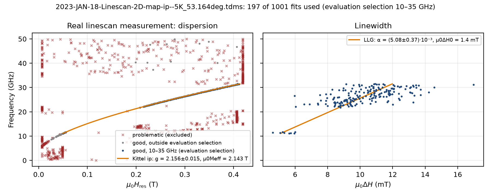

# Outliers, projects, settings, saving

**Outliers / ignore** (`Ctrl+M` in the color plot, `Ctrl+I` for the current fit, or in the Kittel window `Ctrl+K`): point removed from Kittel/LLG, plots and global parameters (gray, status `ignoriert`); single fit kept; column `ausreisser` in export; panel *Re-include*; `Ctrl+Z`.

**Kittel window:** toolbar *Select* (click toggles a point, box adds), full view, pan, zoom. *Hide selection* (`Del`) applies to main window/color plot (gray; per mode). *Show hidden points* + *Show selection* re-includes; `Esc` clears the selection.



**Project** (*File → Save project*, JSON): source, channel mapping, evaluation selection, γ, windows, zones, **corridors** (per mode, with results of modes 2…n), outliers, **rating per fit**, unfitted placeholders, number of modes, physical parameters, processing chain, `programm`. Loading = re-read TDMS + **recompute all fits deterministically**. Never saved: zoom, window layout.

**Auto-backup:** 15 s after every change and on exit (*File → Restore auto-backup*).

**Settings** (*File → Settings*): physical parameters, processing chain, display, export columns, region fit options → `*.polderfit-einstellungen.json`; *Save as default* stores them in the config directory (Windows `%APPDATA%\PolderFit`, Linux `~/.config/polderfit`, macOS `~/Library/Application Support/PolderFit`; env `POLDERFIT_KONFIG`), loaded at start.

**Save / export:** *Save everything* (`Ctrl+Shift+S`) writes selected parts with a common base name: project, Excel, CSV, Kittel/LLG (Excel + CSV + PNG/PDF), color plot image/matrix, TDMS, settings. Excel/CSV contain all parameters in column groups (*Export columns*): resonance field and linewidth in **T and mT**, α, amplitude/phase, background, quality, window, status/rating, temperature; one sheet *Einzelfits_M<k>* per further mode; sheet *Global* (Kittel/LLG); extra sheets *Einstellungen*, *Zonen_Korridore*, *Ausreisser*. CSV optionally German (`;`, decimal comma).

```python
speichere_sitzung(stapel, "sitzung.json", physik=p.als_dict(), verarbeitung=kette.als_dict(), korridore=korridore)
daten = lade_sitzung("sitzung.json")
ds = lade_tdms(daten["quelle"], zuordnung={r: tuple(p) for r, p in daten["zuordnung"].items()}, layout=daten["format_typ"])
stapel = stelle_stapel_wieder_her(daten, ds)
exportiere_excel(stapel.ergebnisse, "fits.xlsx", spalten=["kern", "status"], nur_gefittete=True)
```
