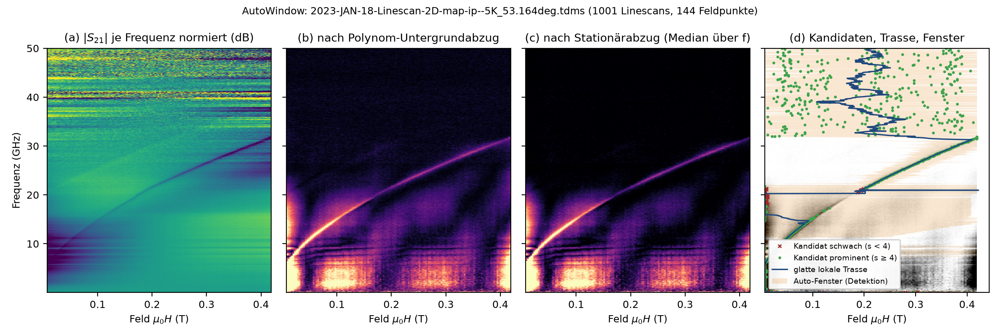

# AutoWindow

Kritischster Schritt: falsches Fenster ⇒ falsche Werte ohne Optimierer-Fehler. Prinzip: **die Resonanz wandert mit f (Kittel), Störungen sitzen bei festen Feldern.**

| Schritt | Funktion | Kern |
|---|---|---|
| 1 Untergrundabzug je Linescan | `_detrend_residuum` | Polynom (Grad ≈ 1 je 0,5 T, 2…6) an Re/Im; Residuum `\|S21 − P(B)\|` |
| 2 Stationärabzug (nur gemeinsames Feldgitter) | `_stationaeren_untergrund_abziehen` | `stat[B] = median_f r(f,B)`; `max(0, r − stat)` |
| 3 Kandidat + Prominenz | `_kandidat` | `argmax`; `s = (max − med)/(1,4826·MAD)`; verlässlich ab `s ≥ 4` |
| 4 glatte lokale Trasse | `_glatte_lokale_trasse` | gleitende robuste Gerade (31 Punkte, MAD-Verwerfung); Rückfall: robustes Polynom ≤ 2 |
| 5 Fenster | `_fenster_um` | Kandidat, wenn prominent + trassenkonsistent, sonst Trasse + `_verfeinere_zentrum`; Halbbreite `max(8·FWHM/2, 6ΔB)`, Deckel 0,4 T |

Grenzen: ΔH ≳ 0,3 T (Deckel, Polynom verschluckt Linie), sehr schwaches Signal nahe ip, AFM-Proben, dominante stationäre Hochfeldartefakte → Dispersion manuell vorgeben (`zentren`).
