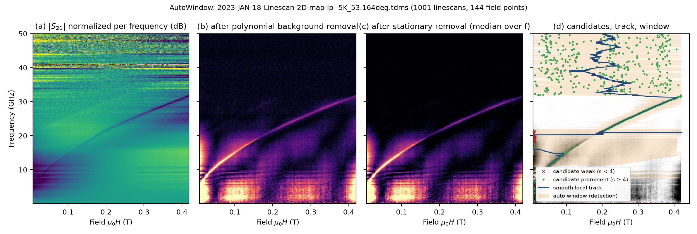

# AutoWindow

Most critical step: wrong window ⇒ wrong values without optimizer error. Principle: **the resonance moves with f (Kittel), disturbances sit at fixed fields.**

| Step | Function | Core |
|---|---|---|
| 1 background removal per linescan | `_detrend_residuum` | polynomial (degree ≈ 1 per 0.5 T, 2…6) on Re/Im; residual `\|S21 − P(B)\|` |
| 2 stationary removal (common field grid only) | `_stationaeren_untergrund_abziehen` | `stat[B] = median_f r(f,B)`; `max(0, r − stat)` |
| 3 candidate + prominence | `_kandidat` | `argmax`; `s = (max − med)/(1.4826·MAD)`; reliable for `s ≥ 4` |
| 4 smooth local track | `_glatte_lokale_trasse` | moving robust line (31 points, MAD rejection); fallback: robust polynomial ≤ 2 |
| 5 window | `_fenster_um` | candidate if prominent + on track, else track + `_verfeinere_zentrum`; half-width `max(8·FWHM/2, 6ΔB)`, cap 0.4 T |

Limits: ΔH ≳ 0.3 T (cap, polynomial swallows line), weak signal near ip, AFM samples, dominant stationary high-field artefacts → give dispersion manually (`zentren`).
