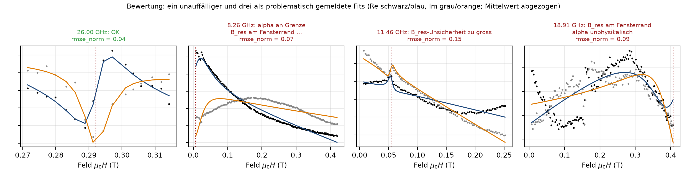

# Bewertung der Fits

`bewerte_fit` (`fit/kriterien.py`) – problematisch, sobald **eine** Bedingung zutrifft:

| | Kriterium | Bedingung | Konstante |
|---|---|---|---|
| a | Residuum | `rmse_norm > 0.35` (RMSE/Signalhub nach Untergrundabzug); Notbremse `chi2_red > 1e6` | `RMSE_NORM_SCHWELLE`, `CHI2_RED_NOTBREMSE` |
| b | an Schranke | `alpha`, `phi`, `B_res` innerhalb 1 % des Schrankenabstands | `GRENZ_NAEHE_REL` |
| c | außerhalb | `B_res` ∉ Fenster | |
| d | unphysikalisch | `alpha > alpha_plausibel` (Standard `alpha_max/2` = 0.05; einstellbar `Strg+P`) | `ALPHA_PLAUSIBEL_MAX` |
| e | Konvergenz/Kovarianz | kein Erfolg; keine Unsicherheiten **und** `rmse_norm > 0.10` | `RMSE_NORM_EXZELLENT` |
| f | Unsicherheit | `B_res_err/|B_res| > 2 %` | `B_RES_REL_UNSICHERHEIT_MAX` |

R² ist **kein** Gütemaß (Untergrund dominiert die Varianz → R² ≈ 1 auch ohne Resonanz). `chi2_red` (Rauschen aus zweiten Differenzen, MAD/√6) wird exportiert, nicht zur Einstufung genutzt.

Nur unproblematische Fits gehen in Kittel/LLG (`_gute_ergebnisse`). Schwellen nicht zur Schönung lockern. Bei mehreren Moden werden b–d für jede Mode geprüft.

## Nutzer-Bewertung und Status-Farben

`FitErgebnis.bewertung` ∈ `auto` (Kriterien entscheiden) · `bestaetigt` (gilt als gut) · `verworfen` (gilt als problematisch); `problematisch` ist der wirksame Zustand, `problematisch_auto` das reine Kriterienergebnis (beides im Export). Gezielte Einzel-Nachfits (Grenzen ziehen, Nochmal fitten) werden standardmäßig `bestaetigt` (`nachfit_bestaetigen`, Strg+P); Bereichs-/Grenzgeraden-Fits über viele Frequenzen, Zonen-Nachrechnungen und Projekt-Wiederherstellung bleiben `auto`. `setze_bewertung` liefert eine Kopie (Undo-sicher).

Farben und Formen nach DIN EN 60073 / ISO 3864 (`gui/farben.py`); Form als zweites Merkmal (DIN EN ISO 9241-125):

| Status | Farbe | Marker | Bedeutung |
|---|---|---|---|
| `gut` | grün | ● | Kriterien erfüllt |
| `bestaetigt` | grün, blauer Rand | ● | vom Nutzer als gut bestätigt |
| `problem` | gelb | ▲ | Kriterien verletzt oder vom Nutzer verworfen – prüfen |
| `fehler` | rot | ✕ | keine Konvergenz / kein Ergebnis |
| `ignoriert` | grau, dunkler Rand | ● | Ausreißer (nur mit *Ansicht → Ignorierte anzeigen*) oder nicht gefittet |
| Mode k ≥ 2 | Mode-Farbe | ● | Korridor-Fit einer weiteren Mode (Status wie Mode 1) |

Blau kennzeichnet aktive Modi, Auswahl und Bedienzustände; gelb Warnungen im Protokoll, rot Fehler.
