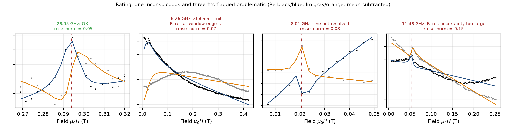

# Fit rating

`bewerte_fit` (`fit/kriterien.py`) – problematic as soon as **one** condition holds:

| | Criterion | Condition | Constant |
|---|---|---|---|
| a | residual | `rmse_norm > 0.35` (RMSE/signal swing after background removal); emergency brake `chi2_red > 1e6` | `RMSE_NORM_SCHWELLE`, `CHI2_RED_NOTBREMSE` |
| b | at bound | `alpha`, `phi`, `B_res` within 1 % of the bound range (`alpha` logarithmic) | `GRENZ_NAEHE_REL` |
| c | outside | `B_res` ∉ window | |
| d | unphysical | `alpha > alpha_plausibel` (default `alpha_max/2` = 0.05; `Ctrl+P`) | `ALPHA_PLAUSIBEL_MAX` |
| e | convergence/covariance | no success; no uncertainties **and** `rmse_norm > 0.10` | `RMSE_NORM_EXZELLENT` |
| f | uncertainty | `B_res_err/|B_res| > 2 %` | `B_RES_REL_UNSICHERHEIT_MAX` |
| g | too few points | < 12 points in window/corridor | `MIN_PUNKTE_FIT` |
| h | line not resolved | `µ0ΔH < 1.5` field steps (`Ctrl+P`, 0 = off; YIG) | `DH_MIN_FELDSCHRITTE` |

R² is **no** quality measure (background dominates the variance → R² ≈ 1 even without resonance). `chi2_red` (noise from second differences, MAD/√6) is exported, not used for rating.

Only unproblematic fits enter Kittel/LLG (`_gute_ergebnisse`). With several modes, b–d are checked per mode.

## User rating and status colors

`FitErgebnis.bewertung` ∈ `auto` (criteria decide) · `bestaetigt` (counts as good) · `verworfen` (counts as problematic); `problematisch` = effective state, `problematisch_auto` = criteria only (both exported). Targeted single refits are `bestaetigt` by default (`nachfit_bestaetigen`, `Ctrl+P`); region/corridor fits, zone recomputation and project restore stay `auto`. *Functions → Rating of the current fit → Refit all fits and confirm as good* sets `bestaetigt` for all fits of the mode (except `verworfen`/outliers). Changing α plausibility/resolution (`Ctrl+P`) re-rates existing fits (`bewerte_alle_neu`). `setze_bewertung` returns a copy (undo-safe).

Colors and shapes per DIN EN 60073 / ISO 3864 (`gui/farben.py`); shape as second cue (DIN EN ISO 9241-125):

| Status | Color | Marker | Meaning |
|---|---|---|---|
| `gut` | green | ● | criteria met |
| `bestaetigt` | green, blue edge | ● | confirmed good by user |
| `problem` | yellow | ▲ | criteria violated or rejected by user – check |
| `fehler` | red | ✕ | no convergence / no result |
| `ignoriert` | gray, dark edge | ● | outlier (only with *View → Show ignored points (outliers) in gray*) or not fitted |
| mode k ≥ 2 | mode color | ● | corridor fit of a further mode |

Blue marks active modes, selection and control states; yellow warnings in the log, red errors.
