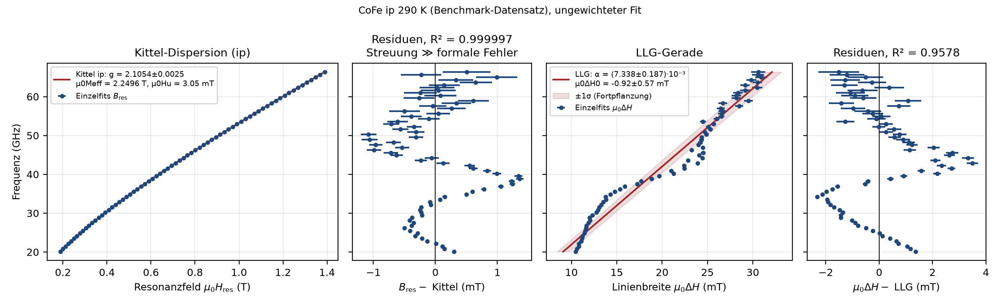

# PolderFit – Breitband-FMR-Auswertung

Name und Version: `pyproject.toml` (`[tool.polderfit] name`, `[project] version`) → Anzeige `PolderFit V<Version>` (`polderfit.PROGRAMMNAME`).

**Zweck:** TDMS-Messdaten (bbFMR) → je Frequenz Resonanzfeld `B_res` und Linienbreite `µ0ΔH` (mit 1σ) → Kittel/LLG → `g`, `µ0M_eff`, `µ0H_u`, `α`, `µ0ΔH_0`.

**Konventionen**

| Größe | Einheit / Regel |
|---|---|
| Felder | immer `µ0H` in **T** |
| γ | `g·µ_B/ħ` in rad s⁻¹ T⁻¹ (g = 2 → 1,7588·10¹¹) |
| `µ0ΔH` | FWHM der Absorption χ″ (nicht von \|χ\|: Faktor √3) |
| Plots | **x = Feld, y = Frequenz** |
| `*_err` | 1σ aus der Fit-Kovarianz |

**Auswertekette**

| Schritt | Modul |
|---|---|
| 1 Laden + Kanal-Mapping | `io/tdms_laden.py`, `io/kanal_mapping.py` |
| 2 AutoWindow (Fenster je Frequenz) | `fit/autowindows.py` |
| 3 Beschnitt | `fit/autowindows.py: schneide_band` |
| 4 Einzelfit (LM) + Nachfenster `B_res ± 2,5·ΔH` | `fit/linescan_fit.py`, `fit/batch.py` |
| 5 Bewertung (a)–(f) + Nutzer-Bewertung | `fit/kriterien.py`, `fit/linescan_fit.py` |
| 6 Kittel/LLG | `physik/kittel_llg.py`, `auswertung/uebersicht.py` |
| Export, Projekt, Einstellungen, Auto-Sicherung | `persistenz/` |
| Farben nach DIN EN 60073 | `gui/farben.py` |

Nachschlagen: [Schnellreferenz](referenz.md). Vergleich mit dem LabVIEW-FTF: `benchmark_ftf/einfacher_vergleich_2026-08-25/VERGLEICH_EINFACH.md` (einfach: PolderFit minus FTF je Frequenz, eigener Ordner) und `benchmark_ftf/BERICHT.md` (ausführlich).
