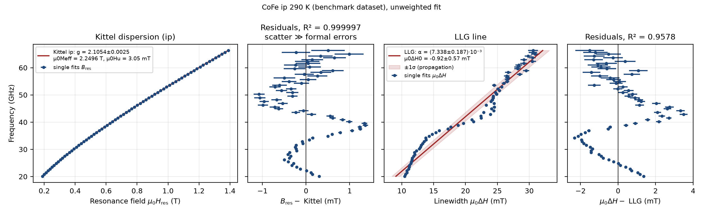

# Python tool for bbFMR

**Version 2.2.108 · Last updated 30.09.2026**

TDMS (bbFMR) → per frequency `B_res`, `µ0ΔH` (1σ) → Kittel/LLG → `g`, `µ0M_eff`, `µ0H_u`, `α`, `µ0ΔH_0`.
Name/version: `pyproject.toml` (`[tool.polderfit] name`, `[project] version`) → `polderfit.PROGRAMMNAME`.

**Conventions**

| Quantity | Unit / rule |
|---|---|
| Fields | always `µ0H` in **T** |
| γ | `g·µ_B/ħ` in rad s⁻¹ T⁻¹ (g = 2 → 1.7588·10¹¹) |
| `µ0ΔH` | FWHM of the absorption χ″ (not of \|χ\|: factor √3) |
| Plots | **x = field, y = frequency** |
| `*_err` | 1σ from the fit covariance |

**Pipeline**

| Step | Module |
|---|---|
| 1 Load + channel mapping | `io/tdms_laden.py`, `io/kanal_mapping.py` |
| 2 AutoWindow (window per frequency) | `fit/autowindows.py` |
| 3 Cropping | `fit/autowindows.py: schneide_band` |
| 4 Single fit (LM) + post-window `B_res ± 2.5·ΔH`; several dips per window/corridor: peeling → sum fit with segment bounds (optional BIC) | `fit/linescan_fit.py`, `fit/batch.py`, `fit/korridor.py` |
| 5 Rating (a)–(h) + user rating | `fit/kriterien.py`, `fit/linescan_fit.py` |
| 6 Kittel/LLG | `physik/kittel_llg.py`, `auswertung/uebersicht.py` |
| Export, project, settings, auto-backup | `persistenz/` |
| Colors per DIN EN 60073 | `gui/farben.py` |

See also: [Quick reference](referenz.md), [Comparison with LabVIEW FTF](vergleich-ftf.md).
