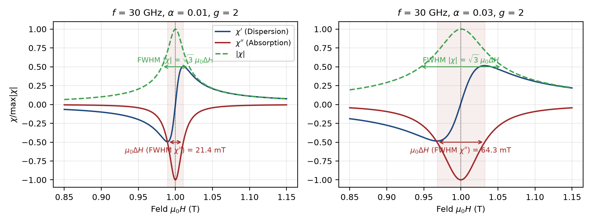
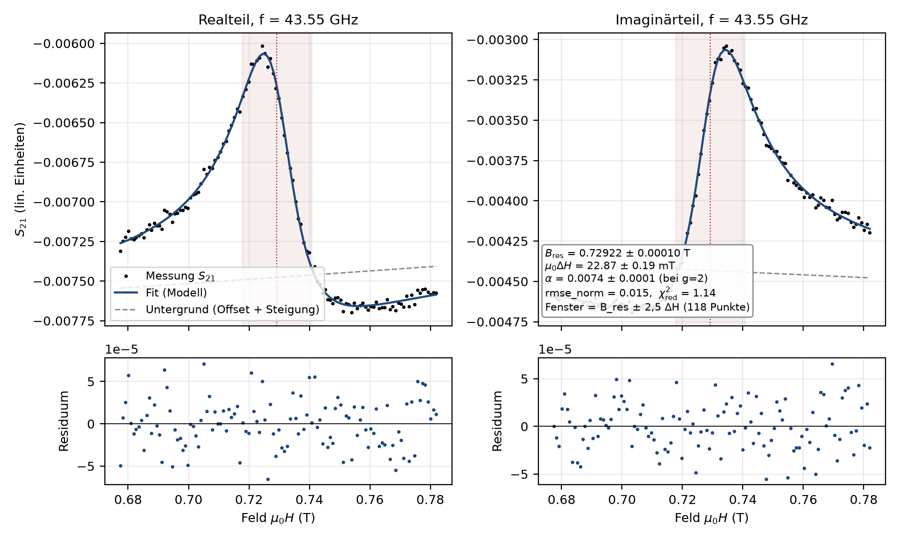
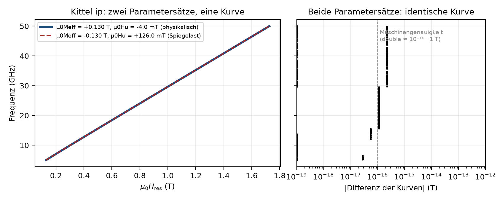

# Physik und Fit

**Suszeptibilität (oop, Notebook-Form, `chi_oop`)** mit `d = µ0H − µ0M_eff`, `N = γ⁴d⁴ + 2(α²−1)γ²d²ω² + (1+α²)²ω⁴`:

```
χ'  =  γ²µ0 d (γ²d² + (α²−1)ω²) / N
χ'' = −αγµ0ω (γ²d² + (1+α²)ω²) / N        Resonanz: µ0H = µ0M_eff + ω/γ  (intern µ0M_eff = B_res − ω/γ)
µ0ΔH = 2ωα/γ                                (FWHM von χ'', Müller 2.27)
```



**Einzelfit-Modell (`s21_modell`, 8 Parameter, Re/Im simultan, ungewichtet):**

```
S21(B) = A·e^{iφ}·χ_oop(B; B_res, α, ω, γ) + (o_re + i o_im) + (s_re + i s_im)(B − B_ref)
```

| Parameter | Schranke |
|---|---|
| `B_res` | im Fenster (verbindlich) |
| `alpha` | `[1e-5, alpha_max]`, Standard `alpha_max = 0.1` (GUI bis 2) |
| `phi` | `[−2π, 2π]` |
| `A`, Offsets, Steigungen | frei |

Optimierer: lmfit `leastsq` (Levenberg–Marquardt/MINPACK), Schranken per MINUIT-Transformation, φ-Neustart um π bei fehlender Kovarianz. Startwerte datengetrieben; `α_start = γ·FWHM(|χ|)/(2√3·ω)`.

**Mehrere Moden (Korridore, `fit/korridor.py`, `fitte_mode`)** – z. B. zwei nahe Dips oder eine vermiedene Kreuzung: kein Summenfit. Jede Mode hat einen Korridor (Ankerpunkte an wenigen Frequenzen, dazwischen linear) und wird je Frequenz als **Einzelfit mit einer Polder-Linie ausschließlich auf den Messpunkten im Korridor** gefittet; Punkte außerhalb sind maskiert. Startwert `B_res` aus dem lokalen Dip im Korridor, sonst vom Nachbarn; Nachfenster ±2,5·ΔH innerhalb des Korridors. Weniger als 12 Punkte oder ΔH unter 1,5 Feldschritten → problematisch. Kittel/LLG und Export je Mode getrennt.




**Kittel / LLG (`kittel_llg.py`, `curve_fit`):**

```
oop: B_res = µ0M_eff + 2πf/γ                                     (2.24)
ip:  B_res = √[(2πf/γ)² + (µ0M_eff/2)²] − µ0M_eff/2 − µ0H_u       (2.26), Schranke µ0M_eff ≥ 0, intern g-parametrisiert
LLG: µ0ΔH(f) = µ0ΔH_0 + (4π/γ)·α·f                               (2.28), γ aus Kittel übernommen
```

Standard **ungewichtet** (wie FTF); Option `w = 1/u²`. `absolute_sigma=False`: Parameterfehler skalieren mit der Punktstreuung. `u(g) = ħ/µ_B·u(γ)`; `u(α)/α = √[(u(m)/m)² + (u(γ)/γ)²]`.



**Einstellbar (Strg+P):** g (Start), γ festhalten, Geometrie oop/ip, Fensterfaktor 8, R²-Schwellen 0,9, Gewichtung aus, α-Obergrenze 0,1, α-Plausibilitätsgrenze (0 = α_max/2), Nachfenster 2,5, Resonanzen je Linescan 1, Nachfits bestätigen an. Speicher-/ladbar als Voreinstellung (Datei → Einstellungen).

Quellen: Müller 2023 Kap. 2; Notebook `Chi_Fit_Functions_and_Inductances_2020-04-06.nb`; Maier-Flaig 2018; Protokoll 2026-05-08; ABW/GUM.
