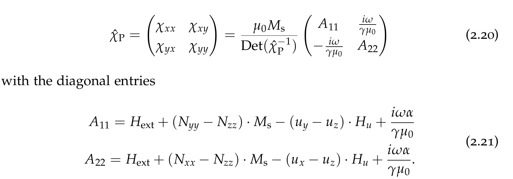
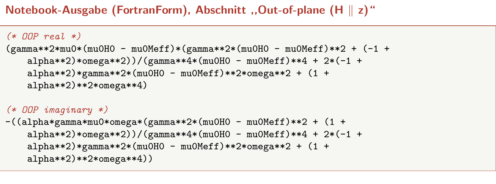
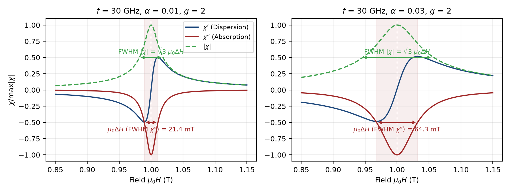
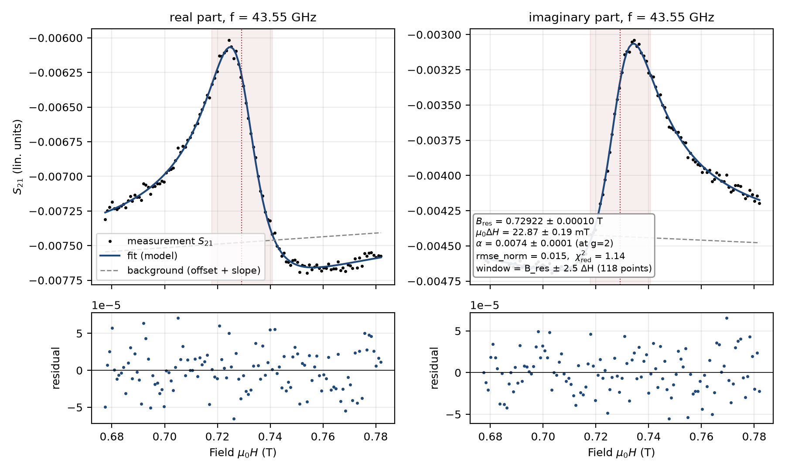
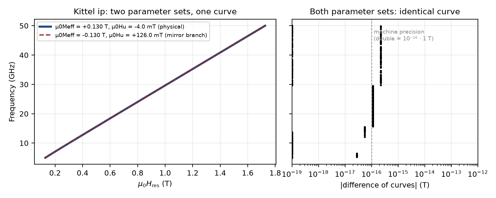

# Physics and fit

**Susceptibility (oop, notebook form, `chi_oop`)** with `d = µ0H − µ0M_eff`, `N = γ⁴d⁴ + 2(α²−1)γ²d²ω² + (1+α²)²ω⁴`:

```
χ'  =  γ²µ0 d (γ²d² + (α²−1)ω²) / N
χ'' = −αγµ0ω (γ²d² + (1+α²)ω²) / N        resonance: µ0H = µ0M_eff + ω/γ  (internally µ0M_eff = B_res − ω/γ)
µ0ΔH = 2ωα/γ                                (FWHM of χ'', Müller 2.27)
```

Polder tensor (Müller eq. 2.20/2.21) → oop form from the notebook, taken over 1:1 (`suszeptibilitaet.py`):






**Single-fit model (`s21_modell`, 8 parameters, Re/Im simultaneous, unweighted):**

```
S21(B) = A·e^{iφ}·χ_oop(B; B_res, α, ω, γ) + (o_re + i o_im) + (s_re + i s_im)(B − B_ref)
```

| Parameter | Bound |
|---|---|
| `B_res` | inside the window |
| `alpha` | `[1e-5, alpha_max]`, default `alpha_max = 0.1` (GUI up to 2) |
| `phi` | `[−2π, 2π]` |
| `A`, offsets, slopes | free |

Optimizer: lmfit `leastsq` (Levenberg–Marquardt/MINPACK), bounds via MINUIT transform, φ restart by π if covariance is missing. Data-driven start values; `α_start = γ·FWHM(|χ|)/(2√3·ω)`.

**Several modes (corridors, `fit/korridor.py`, `fitte_mode`):** each mode has a corridor (anchors at a few frequencies, linear in between) and is fitted per frequency **only on the points inside the corridor**. Start `B_res` from the local dip, else from the neighbour; post-window ±2.5·ΔH inside the corridor. < 12 points or ΔH < 1.5 field steps → problematic. Kittel/LLG and export per mode.



**Kittel / LLG (`kittel_llg.py`, `curve_fit`):**

```
oop: B_res = µ0M_eff + 2πf/γ                                     (2.24)
ip:  B_res = √[(2πf/γ)² + (µ0M_eff/2)²] − µ0M_eff/2 − µ0H_u       (2.26), bound µ0M_eff ≥ 0, internally g-parametrized
LLG: µ0ΔH(f) = µ0ΔH_0 + (4π/γ)·α·f                               (2.28), γ taken from Kittel
```

Default **unweighted** (as FTF); option `w = 1/u²`. `absolute_sigma=False`: errors scale with point scatter. `u(g) = ħ/µ_B·u(γ)`; `u(α)/α = √[(u(m)/m)² + (u(γ)/γ)²]`.



**Adjustable (`Ctrl+P`):** g (start), fix γ, geometry oop/ip, window factor 8, R² thresholds 0.9, weighting off, α upper bound 0.1 (down to 0.00001; lower bound then α_max/100), α plausibility limit (0 = α_max/2, down to 0.00001), post-window 2.5, resonances per linescan 1, confirm refits on. Storable as default (*File → Settings*).

Sources: Müller 2023 ch. 2; notebook `Chi_Fit_Functions_and_Inductances_2020-04-06.nb`; Maier-Flaig 2018; protocol 2026-05-08; ABW/GUM.
