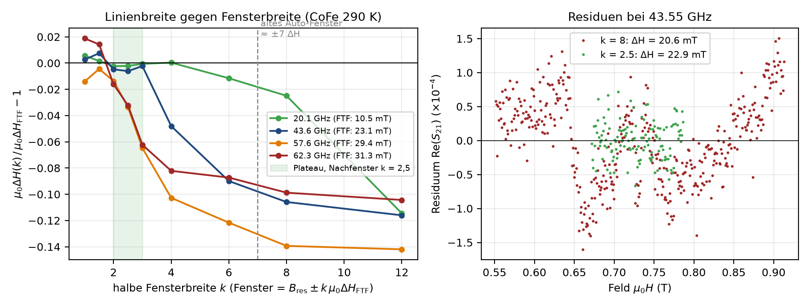

# Ablauf der Auswertung

```python
fenster = auto_fenster_alle(ds, gamma, breite_faktor)              # Phase 1: Fenster je Frequenz
for i, ls in enumerate(ds.linescans):                               # Phase 2: je Frequenz
    ergebnis, beschnitten, verwendet = fitte_mit_nachfenster(
        ls, fenster[i], gamma, alpha_max=alpha_max, nachfenster_faktor=2.5)
    # 1. Fit auf Detektionsfenster -> 2. Fit auf B_res ± 2,5·ΔH (nur übernommen, wenn unproblematisch)
```

| Regel Nachfenster | Wert |
|---|---|
| Fenster | `B_res ± faktor·µ0ΔH` (Standard 2,5; 0 = aus), nie erweitern |
| Mindestpunkte / Halbbreite | ≥ 12 Punkte, ≥ 6 Feldschritte |
| Übernahme | nur wenn 2. Fit erfolgreich und nicht problematisch |
| Grund | auf ±7 ΔH passt der lineare Untergrund nicht → ΔH 5–15 % zu klein (Benchmark) |



`StapelErgebnis`: `fenster`, `zugeschnitten`, `ergebnisse`, `ausschlusszonen`, `ausreisser`; `index_problematisch()`, `problem_statistik()`, `ergebnisse_aktiv()`.
Nachfit einzeln: `fitte_neu(stapel, index, feld_unten, feld_oben, startwerte, B_res_vorgabe)`.
