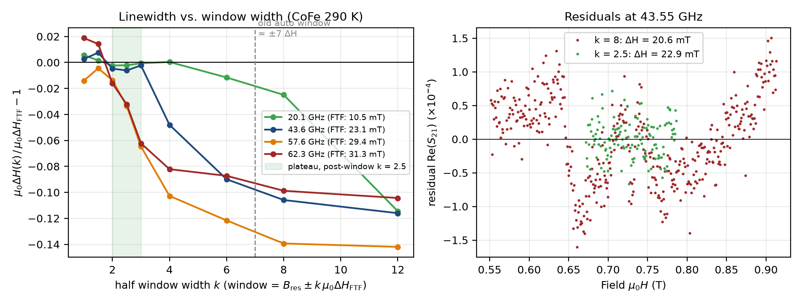

# Pipeline

```python
fenster = auto_fenster_alle(ds, gamma, breite_faktor)              # phase 1: window per frequency
for i, ls in enumerate(ds.linescans):                               # phase 2: per frequency
    ergebnis, beschnitten, verwendet = fitte_mit_nachfenster(
        ls, fenster[i], gamma, alpha_max=alpha_max, nachfenster_faktor=2.5)
    # 1. fit on detection window -> 2. fit on B_res ± 2.5·ΔH (kept only if unproblematic)
```

| Post-window rule | Value |
|---|---|
| window | `B_res ± k·µ0ΔH` (default 2.5; 0 = off), never widened |
| minimum | ≥ 12 points, half-width ≥ 6 field steps |
| accepted | only if 2nd fit succeeds and is unproblematic |
| reason | on ±7 ΔH the linear background does not fit → ΔH 5–15 % too small (benchmark) |



`StapelErgebnis`: `fenster`, `zugeschnitten`, `ergebnisse`, `ausschlusszonen`, `ausreisser`, `ausreisser_moden`, `nebenmoden` (modes ≥ 2), `alpha_plausibel`, `nachfit_bestaetigen`; `ergebnisse_mode(k)`, `moden_vorhanden()`, `index_problematisch()`, `index_gefittet()`, `problem_statistik()`, `ergebnisse_aktiv()`, `bewerte(i, art)`.
Single refit: `fitte_neu(stapel, index, feld_unten, feld_oben, startwerte, B_res_vorgabe, bestaetigen, mode)`; per mode in corridor: `fitte_mode(stapel, index, korridor)`; all frequencies: `fitte_korridor(stapel, korridor, schritt)`. Without Auto-Fit: `leerer_stapel(ds)`.
