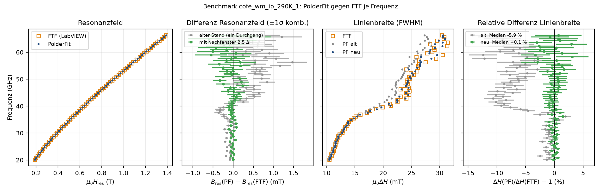

# Robustheitsprüfung (reale Messdaten)

`python tests/autowindow_runner.py [--no-plots] [--rerun-failed-only]` – Daten unter `testdata/`, 90 s je Datei, mehrere Prozesse. Prüfung unabhängig vom AutoWindow reimplementiert (Selbsttest: absichtlich falsche Fenster werden erkannt); Ground Truth = Band der sortierten Gegenstücke.

| Status | Bedeutung |
|---|---|
| `OK` | Fenster plausibel, Fit unauffällig |
| `WINDOW_FLAGGED` | Fensterproblem, **gemeldet** (zulässig) |
| `WINDOW_FAIL` | Fensterproblem, **still** (Fehlerfall) |
| `KEIN_ZIEL` | keine Resonanz im Feldbereich |
| Datei: `CRASH`, `TIMEOUT`, `NICHT_FMR` | |

Letzter Lauf (286 Linescan-Dateien, 25 Probentypen, 12 GB, ~131 000 Resonanzen; `tests/AUTOWINDOW_ROBUSTHEIT_BERICHT.md`):

| | Baseline | aktuell |
|---|---|---|
| CRASH | 38 | 0 |
| still falsch | 2,3 % | 0,4 % (sortiert: 0) |
| OK + gemeldet | 97,7 % | 99,6 % |

Ergebnisse: `tests/autowindow_results.json`, Plots `diag/`. FTF-Benchmark: `benchmark_ftf/BERICHT.md`, `python benchmark_ftf/run_benchmark.py`.

