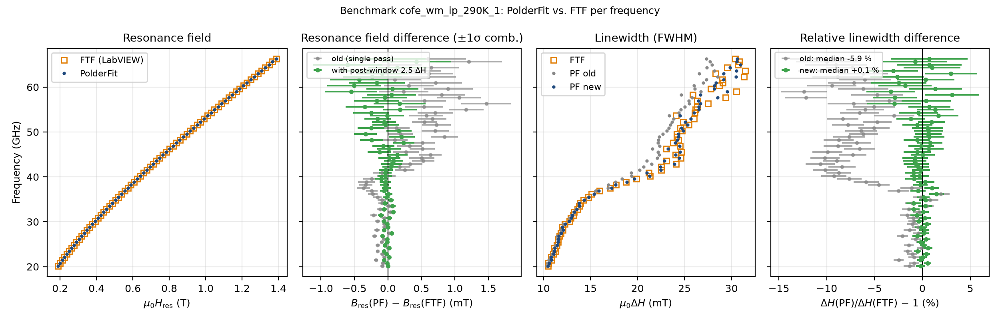

# Robustness check (real data)

`python tests/autowindow_runner.py [--no-plots] [--rerun-failed-only]` – data in `testdata/`, 90 s per file, several processes. Check re-implemented independently of AutoWindow (self-test: wrong windows are detected); ground truth = band of the sorted counterparts.

| Status | Meaning |
|---|---|
| `OK` | window plausible, fit fine |
| `WINDOW_FLAGGED` | window problem, **reported** (allowed) |
| `WINDOW_FAIL` | window problem, **silent** (failure) |
| `KEIN_ZIEL` | no resonance in field range |
| file: `CRASH`, `TIMEOUT`, `NICHT_FMR` | |

Last run (286 linescan files, 25 sample types, 12 GB, ~131 000 resonances; `tests/AUTOWINDOW_ROBUSTHEIT_BERICHT.md`):

| | Baseline | Current |
|---|---|---|
| CRASH | 38 | 0 |
| silently wrong | 2.3 % | 0.4 % (sorted: 0) |
| OK + reported | 97.7 % | 99.6 % |

Results: `tests/autowindow_results.json`, plots `diag/`. FTF benchmark: `benchmark_ftf/BERICHT.md`, `python benchmark_ftf/run_benchmark.py`.

