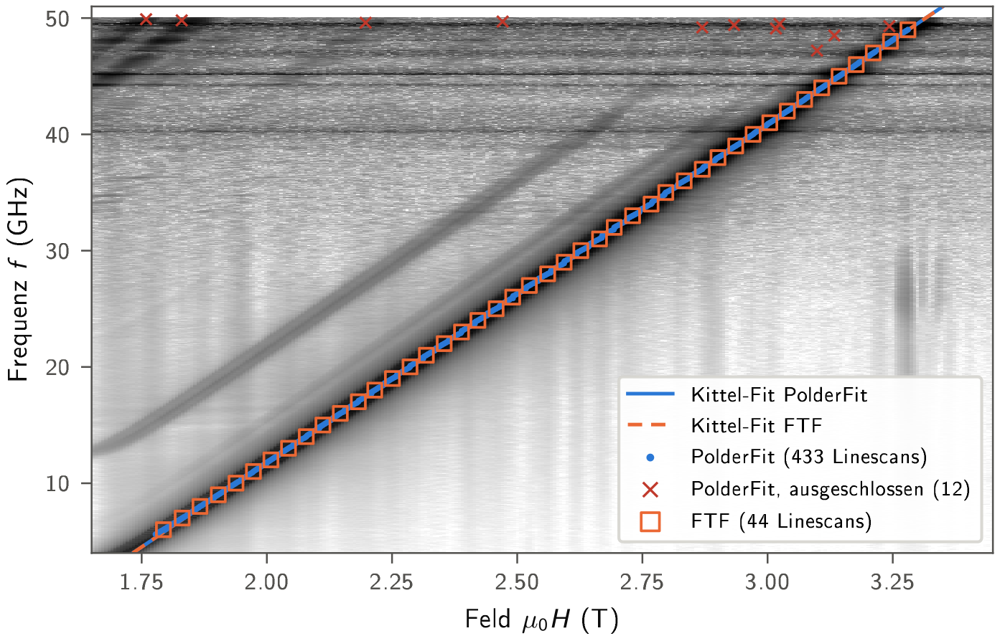
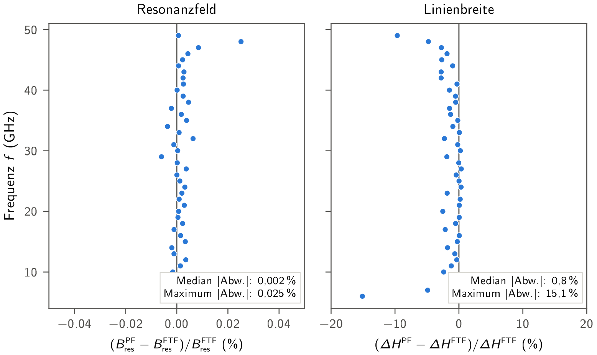
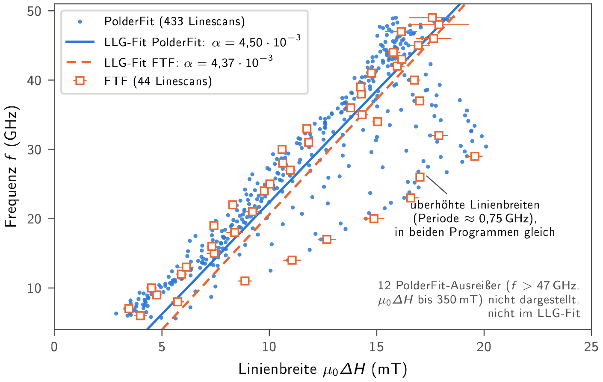
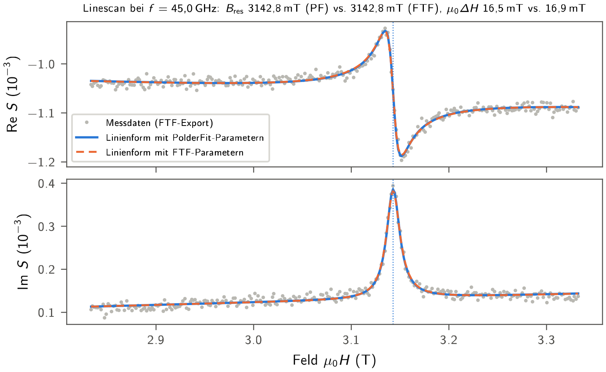

# Comparison with LabVIEW FTF

CoFeSiB 40 nm on Si (675 µm), oop, 5 K (`2025-FEB-14-Linescan-2D-map-oop-rotated-5K_0.1deg`). FTF: 44 frequencies (1 GHz grid); PolderFit: 445 (0.1 GHz grid), 433 used, 12 excluded.

Both Kittel lines coincide.

44 common frequencies: `B_res` median 0.002 % (max 0.025 %); `µ0ΔH` median 0.8 % narrower, 40/44 within 3 % (largest: 6 GHz −15 %, 49 GHz −10 %).

Periodically increased linewidths (≈ 0.75 GHz = 15 raw frequency steps) appear in both programs → from the data, not the fit.

Line shape with `B_res` and `µ0ΔH` of each program (amplitude and background by linear least squares).

| | FTF (44) | PolderFit (433) | PolderFit (same 44) | Δ 433 | Δ same 44 |
|---|---|---|---|---|---|
| g | 2.0755 ± 0.0016 | 2.0756 ± 0.0005 | 2.0753 ± 0.0015 | +0.003 % | −0.009 % |
| µ0M_eff (T) | 1.5944 ± 0.0008 | 1.5945 ± 0.0003 | 1.5944 ± 0.0008 | +0.006 % | −0.002 % |
| α (10⁻³) | 4.37 ± 0.42 | 4.50 ± 0.12 | 4.21 ± 0.42 | +3.19 % | −3.50 % |
| µ0ΔH_0 (mT) | 3.80 ± 0.89 | 3.07 ± 0.24 | 3.89 ± 0.87 | −19.34 % | +2.31 % |

Same points → same results; differences come from the number of linescans.
More: `benchmark_ftf/BERICHT.md`, [robustness check](test-harness.md).
